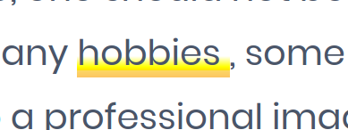

# How to Make Cool Underlines for Links with TailwindCSS
Making underlines for links instead of changing the color of the letters improves a lot the readability of documents. However, underlining itself does not allow to control the thickness of the line nor its color. There are two ways to achieve control on how the underlining looks like: using the ``boxShadow`` property of [[TailwindCSS]], or tuning the background image.  

## Box Shadow
Tailwind provides some basic shadows, but if we want to add custom shadows to our links, we must edit the **tailwind.config.js** file, and add the following:

```javascript
    theme: {
        extend: {
            boxShadow: {
                link: '0 -4px 0 0 rgba(178, 245, 234, .7) inset',
            },
	},
}
```

The syntax is exactly what [box-shadow](https://www.w3schools.com/CSSref/css3_pr_box-shadow.asp) takes. Now, if we want to underline a link, we can use the following in the HTML:

```html
<a href="target.html" class="no-underline shadow-link">target</a>
```

We can also apply it globally to all links, by adding the following to the **style.css** file:

```css
@tailwind base;

a {
    @apply no-underline shadow-link;
}

@tailwind components;
```

## Background Image
Using a background image as an underline requires slightly more tuning but allows for much more stunning results. We can add to **style.css** after the ``@tailwind utilities`` line:

```css
@layer base {
    a {
        background-image: linear-gradient(to top, orange, yellow, transparent);
        background-position: 0 110%;
        background-repeat: no-repeat;
        background-size: auto .75rem;
    }
}
```

We use the ``@layer base`` to create a global style that will be applied to all the ``a`` tags. The rest is CSS code to create a linear gradient that goes from orange, to yellow to transparent, from bottom to top. The result would like in the image below:



So, if you see those fancy underlines and want to create them with Tailwind, you know now where to start!