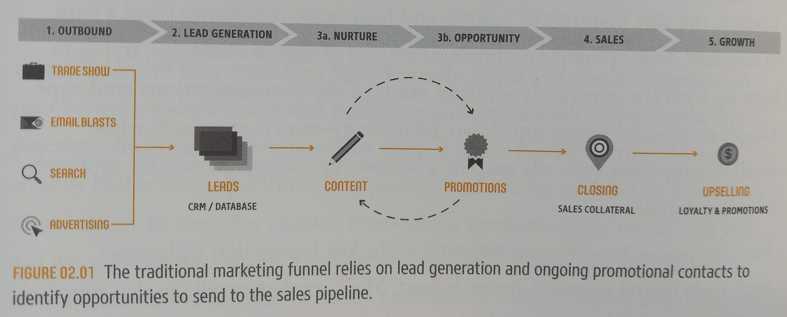

> Other than at trade shows, where people make direct inquiries, leads are typically gathered as a result of a call-to-action on the company's website or on a discrete landing page, in exchange for something. [@ghanadan2016]

What Ghanadan argues is that most companies spend money across the funnel. However, the ROI is not homogeneous. In order for companies to jump into the new aspects that [[social media for scientific marketing]] and [[the role of search engines for scientific marketing]] open, it is important to evaluate carefully what is done with the money. 

In marketing there are many assumptions, for example to be able to upsell to a customer the company must have a very detailed database. If you already know you don't have it and probably never will, does it make sense to keep pushing an outdated, unrealistic, funnel model? 